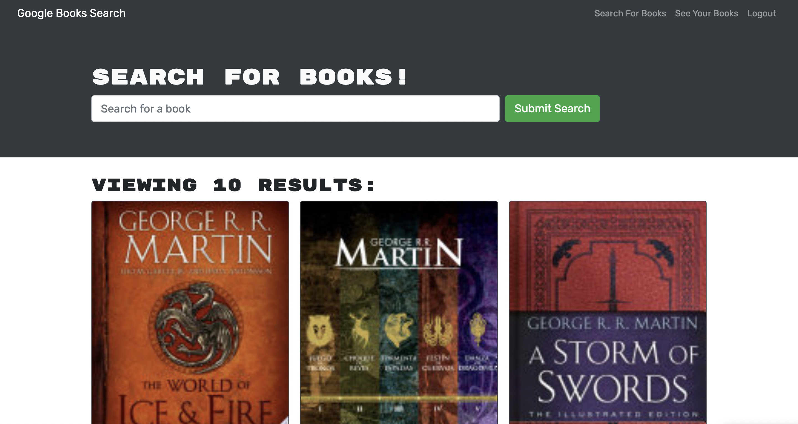

# Book Search Engine

## Description
    
This MERN stack application allows you to search for books and save them in your account.
    
## Table of Contents
    
- [Usage](#usage)
- [Contribute](#contribute)
- [Questions](#questions)
        
## Usage
    
Login into your account or Sign Up. Use the search bar to search for a book, author, etc. Click on 'Save this Book! to save a book. Then you can click on 'See Your Books' on the top right of your screen to see all the books you have saved.

## Contribute
    
If you would like to contribute to this project, feel free to make a pull request.

## Questions

If you have any questions, open an issue or contact me directly at abimael.monarrez58@gmail.com. You can find more of my work at [Abimael1996](https://github.com/Abimael1996).

